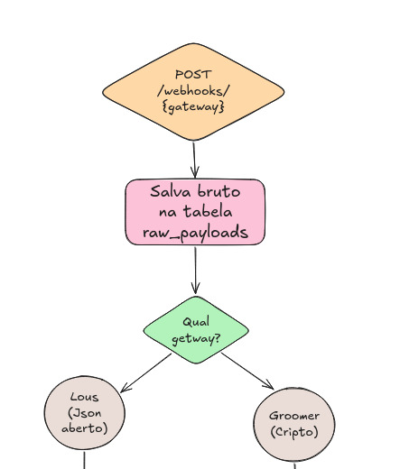
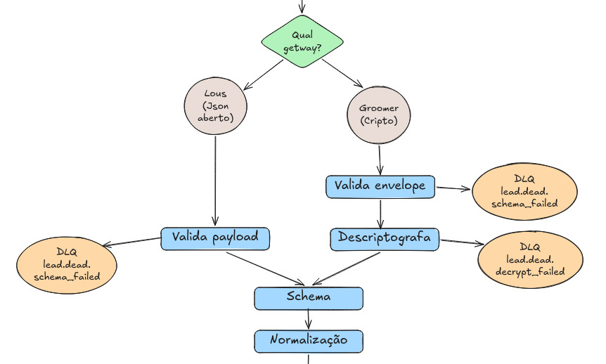
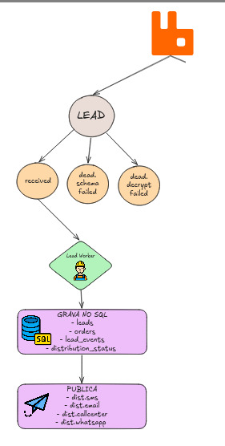

# Conceitual — Parte A: Resolução de incidente

## Cenário

Na segunda de manhã, o PO informa que o gateway registrou **US$ 1.3M em vendas aprovadas**, com **1.587 transações** no dashboard de sexta-feira. No nosso sistema, existem apenas **421 registros em `lead_events` com `event = 'order.approved'`** no mesmo período. Além disso, o call center está há 4 horas sem leads.

EU não saíria reiniciando serviço nem reprocessando dados no escuro. Em primeiro lugar, eu tentaria confirmar exatamente qual janela o gateway usou: 
- timezone
- gateway
- critério de “approved”
- se o número foi calculado por `transaction_time`
- se foi calculado pelo horário em que o gateway processou/enviou o evento

Isso muda bastante a leitura do incidente. `transaction_time` representa o horário real da compra. `received_at` mostra quando o webhook chegou no nosso sistema. Se o gateway está olhando uma coisa e a nossa query está olhando outra, pode acabar transformando atraso operacional em falso buraco de vendas.

No fluxo implementado, `lead_events` é gravado pelo **Lead Worker**, depois que o receiver valida o payload e publica a mensagem na fila `lead.received`.

O caminho relevante é:

```text
gateway
  -> receiver HTTP
  -> raw_payloads
  -> decrypt/schema/normalização/idempotência
  -> lead.received
  -> Lead Worker
  -> leads / orders / lead_events
  -> distribution_status
  -> filas de distribuição
```



Esse é o primeiro trecho que eu isolaria. Se o payload nem chegou em `raw_payloads`, o problema está antes de worker, DLQ ou distribuição.

`raw_payloads` é o primeiro ponto gravado no banco. Já `lead_events` só aparece depois que o Lead Worker consome a fila, resolve o pedido e grava o evento. Então `lead_events` baixo não significa automaticamente que o problema está no worker. 
- O webhook pode não ter chegado
- pode ter rolado alguma falha no decrypt/schema
- pode não ter sido publicado em `lead.received`
- pode estar parado na fila

## As cinco hipóteses

1. **Receiver ou infraestrutura falhando antes/durante `raw_payloads`**. Essa é a hipótese mais forte se `raw_payloads` também tiver algo perto de 421–430 registros na janela investigada. Como `raw_payloads` é gravado antes de decrypt, schema, idempotência e fila, um número baixo aqui indica problemas no receiver, API gateway, rede ou insert inicial no banco.

2. **Gateway não enviou tudo ou enviou para endpoint errado**. Se os logs do receiver/load balancer também não mostrarem as chamadas ausentes, é provável que parte dos webhooks nunca tenha chegado até a gente. Nesse caso, eu pediria ao gateway uma amostra dos `transaction_id` ausentes, timestamps, URL usada, HTTP status recebido e histórico de retry.

3. **Janela, timezone ou critério de comparação diferente**. Essa hipótese é simples de validar e pode evitar um falso incidente. O gateway pode estar contando por `transaction_time`, enquanto nossa query usa `received_at`, UTC ou outro período. Também pode haver diferença entre “venda aprovada” no dashboard e o filtro `event = 'order.approved' AND payment.status = 'approved'`.

4. **Falha em massa de `decrypt_failed` ou `schema_failed`**. Se `raw_payloads` estiver próximo de 1.587, mas `lead_events` continuar em 421, eu olharia `lead_dead_letter` antes de culpar o worker. Decrypt e schema acontecem antes da publicação em `lead.received`; se o payload morre ali, ele nunca chega ao Lead Worker.



Se a massa chegou em `raw_payloads`, mas morreu em decrypt/schema, o Lead Worker nem participou do incidente.

5. **Lead Worker ou distribuição travados**. Essa hipótese fica forte quando `raw_payloads` está alto, DLQs de decrypt/schema estão baixas e a fila `lead.received` tem mensagens acumuladas ou sem consumo. Já filas de canal ou `distribution_status` pendente explicam call center sem leads quando o evento de negócio foi criado, mas a entrega posterior não andou.

## Dados, queries e RabbitMQ

Eu compararia poucos pontos fortes, sempre usando a mesma janela:

```sql
SELECT
    COUNT(*) AS total_raw,
    MIN(received_at) AS first_received_at,
    MAX(received_at) AS last_received_at
FROM raw_payloads
WHERE received_at >= '2026-05-08 00:00:00'
  AND received_at < '2026-05-09 00:00:00';
```

Essa primeira leitura não fecha a reconciliação final com o gateway, mas mostra se os webhooks chegaram ao sistema. Para comparar venda com venda, eu volto a `transaction_time`; para entender quando o payload chegou aqui, `received_at` é a métrica certa.

```sql
SELECT reason, source, COUNT(*) AS total
FROM lead_dead_letter
WHERE created_at >= '2026-05-08 00:00:00'
  AND created_at < '2026-05-09 00:00:00'
GROUP BY reason, source
ORDER BY total DESC;
```

```sql
SELECT o.gateway, COUNT(*) AS approved_events
FROM lead_events le
JOIN orders o ON o.id = le.order_id
WHERE le.event = 'order.approved'
  AND le.transaction_time >= '2026-05-08 00:00:00'
  AND le.transaction_time < '2026-05-09 00:00:00'
GROUP BY o.gateway;
```

```sql
SELECT
    COUNT(*) AS pending_channels,
    COUNT(DISTINCT order_id) AS pending_orders
FROM distribution_status
WHERE status = 'pending'
  AND created_at <= UTC_TIMESTAMP() - INTERVAL 5 MINUTE;
```

No RabbitMQ:

```bash
rabbitmqctl list_queues name messages_ready messages_unacknowledged consumers
```

Leitura esperada:

```text
lead.received ready alta + consumers = 0 -> consumer parado
lead.received unacked alta -> consumer travado/lento
lead.dead.decrypt_failed ou lead.dead.schema_failed alta -> falha antes do worker
dist.callcenter/dist.sms alta -> distribuição travada
```

Se as filas estiverem baixas e `raw_payloads` também, eu volto para gateway/receiver. Se `raw_payloads` estiver alto e `lead_dead_letter` concentrar `decrypt_failed` ou `schema_failed`, o worker ainda nem entrou na história. Essa leitura evita investigar a etapa errada só pela pressão do incidente.



Quando lead.received acumula, a investigação muda de receiver para consumo, persistência e retry do Lead Worker.

## Como diferenciar os quatro cenários

| Cenário | Sinais | Ação imediata |
|---|---|---|
| Gateway nunca enviou | `raw_payloads` baixo, logs HTTP sem as requests, DLQ baixa | pedir logs/replay dos `transaction_id` ausentes |
| Webhook chegou, mas decrypt falhou | payload salvo em `raw_payloads`, `body_decrypted` nulo, `decrypt_failed` em DLQ | validar secret, IV/ciphertext, header e mudança de contrato |
| `lead.received` acumulada / consumer travado | bruto alto, DLQ de entrada baixa, fila pronta ou unacked alta, `lead_events` baixo | inspecionar worker, conexão com MySQL, exceções e retry |
| Distribuidor/canal travado | `lead_events` alto, `distribution_status` pending antigo, fila do canal acumulada | investigar o canal específico; isso explica ausência no call center, não o gap de `lead_events` |

## Reprocessamento sem duplicar os 421

Eu classificaria os 1.166 faltantes antes de publicar qualquer replay.

- **Gateway nunca enviou**: solicitar replay controlado apenas dos `transaction_id` ausentes, reconciliados por `gateway + transaction_id + event`.
- **`decrypt_failed`**: corrigir segredo/formato e reprocessar somente os itens identificados pela DLQ/lote auditável que voltarem a ser decriptáveis.
- **`schema_failed`**: separar erro de contrato real de payload inválido; corrigir mapeamento quando houve mudança válida ou pedir novo envio ao gateway. Só republicar payload parseável e elegível.
- **`lead.received` acumulada / consumer travado**: recuperar o consumer e deixar a fila drenar; reenfileirar apenas mensagens comprovadamente perdidas, não tudo.
- **Distribuidor/canal travado**: reprocessar a fila do canal ou os pendentes do canal, sem recriar `lead_events`.

A proteção contra duplicidade continua a mesma:

```text
webhook_idempotency_keys: gateway + transaction_id + event
lead_events: order_id + event
distribution_status: order_id + channel
```

Para o replay dos ausentes, eu criaria uma lista/tabela de reconciliação do gateway e filtraria apenas o que ainda não tem `order.approved` persistido:

```sql
SELECT missing.gateway, missing.transaction_id
FROM gateway_reconciliation_missing missing
LEFT JOIN orders o
    ON o.gateway = missing.gateway
   AND o.transaction_id = missing.transaction_id
LEFT JOIN lead_events le
    ON le.order_id = o.id
   AND le.event = 'order.approved'
WHERE le.id IS NULL;
```

Eu publicaria apenas esse resultado em uma fila de replay dedicada ou em `lead.received` com metadado `replay = true`. Se qualquer um dos 421 já processados entrar por engano, constraints e upserts seguram os efeitos duplicados. O filtro usa o que importa para o incidente: `gateway + transaction_id + event` na origem e `lead_events(order_id, event)` como prova de que o efeito já existe.

Para `decrypt_failed`, eu não faria replay no automático. Primeiro corrigiria secret, IV/ciphertext, header ou formato; depois reprocessaria a DLQ ou um lote auditável e verificaria que o payload voltou a abrir. Para `schema_failed`, a lógica é parecida: classificar se houve mudança válida de contrato ou payload realmente inválido, ajustar o mapeamento quando couber e só republicar o que estiver parseável e elegível.

## Três medidas preventivas

1. **Alertas de funil**: volumes por etapa, DLQ por motivo, idade de `lead.received`, consumo por fila e pending antigo por canal. Não basta alertar erro alto; queda brusca de volume também denuncia perda silenciosa.
2. **Reconciliação automática com o gateway**: comparar `transaction_id`, `gateway`, `event` e `transaction_time` contra `raw_payloads`, `lead_events` e DLQ. O incidente ideal é detectado por job e alerta, não pelo call center depois de quatro horas.
3. **Replay auditável/outbox**: registrar publicações pendentes entre banco e RabbitMQ para reenvio seguro, mantendo `correlation_id` ponta a ponta. Se o bruto foi salvo e a publicação falhou, o sistema precisa saber exatamente o que ficou para trás.
