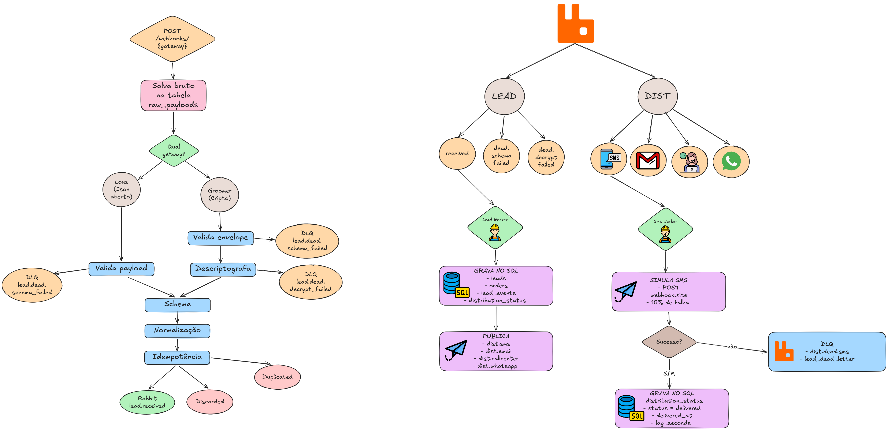

# Explicação técnica — GEX Lead Pipeline

<p align="center">
  
</p>

## 1. Visão geral

Esse projeto implementa uma esteira backend para receber webhooks de gateways de pagamento, validar eventos, persistir dados importantes para auditoria e processar leads de forma assíncrona.

O fluxo começa em `POST /webhooks/{gateway}`. Os gateways aceitos são `lous` e `grummer`.

A API recebe o payload, salva o bruto em `raw_payloads`, trata o formato de cada gateway, valida o schema, normaliza campos críticos, aplica idempotência e publica o resultado em fila ou DLQ.

A prioridade foi rastreabilidade. Mesmo quando um payload falha no decrypt, vem com schema inválido, é descartado ou é duplicado, ele continua registrado no banco para investigação.

---

## 2. Fluxo implementado

Fluxo geral:

```text
receber webhook
  -> gerar correlation_id
  -> salvar payload bruto
  -> decriptar quando necessário
  -> validar schema
  -> normalizar dados críticos
  -> aplicar idempotência
  -> publicar em fila ou DLQ
  -> consumir lead.received
  -> persistir lead, pedido, evento e status de distribuição
  -> publicar eventos de distribuição
  -> consumir dist.sms
  -> enviar POST do SMS
  -> atualizar distribution_status
```

Roteamento de saída:

| Caso | Ação |
|---|---|
| Payload válido, `event = order.approved` e `payment.status = approved` | publica na fila `lead.received` |
| Falha de decrypt | publica na fila `lead.dead.decrypt_failed` |
| Schema inválido | publica na fila `lead.dead.schema_failed` |
| Status diferente de `approved` | descarta do fluxo principal, mas mantém em `raw_payloads` |
| Payload duplicado | retorna sucesso operacional sem republicar |

O worker de leads consome `lead.received` e grava `leads`, `orders`, `lead_events` e `distribution_status` em uma transação única. Preferi fazer assim para evitar estado pela metade. Por exemplo: gravar o pedido, mas falhar antes de criar os status de distribuição.

Depois disso, ele publica:

```text
dist.sms
dist.email
dist.callcenter
dist.whatsapp
```

Só o SMS tem distribuidor implementado de verdade, porque o desafio pedia escolher um canal.

---

## 3. Decisões técnicas

### Python e FastAPI

Usei Python porque o desafio envolve bastante manipulação de JSON, validação de payload, scripts auxiliares e integração com banco/fila.

Usei FastAPI porque ele é simples de subir localmente, combina bem com Pydantic e deixa o fluxo HTTP fácil de entender.

Usei Pydantic para validar e normalizar o payload. Usei `cryptography` para o decrypt AES do Grummer, `pika` para RabbitMQ e `requests` para o POST do SMS.

### Organização por feature

A estrutura foi organizada por feature: `features/webhooks`, `features/debug`, `features/leads`, `features/distribution` e `shared`.

Escolhi esse formato porque os arquivos relacionados ao mesmo fluxo ficam próximos. Quando o bug envolve recebimento de webhook, o caminho para investigar fica em `features/webhooks`. Quando envolve processamento assíncrono, fica em `features/leads` e `features/distribution`.

### SQLAlchemy Core

Usei SQLAlchemy Core em vez de ORM completo.

A ideia foi evitar SQL string espalhada no código da aplicação, mas sem esconder demais o comportamento do banco. Neste teste, o banco é parte importante da solução: idempotência, constraints, índices, auditoria e queries SQL.

Na prática:

```text
SQLAlchemy Core -> código da aplicação
SQL puro        -> scripts em sql/
```

### Idempotência

A chave de idempotência usada no receiver é:

```text
gateway + transaction_id + event
```

Usei também o `gateway` para evitar colisão entre gateways diferentes que possam usar o mesmo identificador de pedido.

A proteção fica no banco por constraint única, e não apenas por uma consulta antes do insert. Isso é importante porque dois webhooks iguais podem chegar quase ao mesmo tempo. Nesse caso, a constraint do banco é quem garante a proteção contra race condition.

### Payload bruto

Todo webhook recebido é salvo em `raw_payloads`.

Isso vale para payload válido, inválido, duplicado, descartado ou com falha de decrypt. Essa decisão facilita investigar se o gateway enviou, se o payload chegou, se falhou no decrypt, se falhou no schema, se foi duplicado ou se foi descartado por status.

Sem esse registro bruto, fica bem mais difícil investigar incidente.

### RabbitMQ e workers

Usei RabbitMQ porque o fluxo do desafio é assíncrono. Receber o webhook não deve depender da velocidade de processamento dos workers nem da entrega em canais externos.

As mensagens são publicadas em filas duráveis.

Os consumers usam `prefetch_count=1`. Dessa forma o RabbitMQ só envia a próxima mensagem quando a anterior recebeu ACK, deixando o processamento do worker mais controlado.

Também criei um helper compartilhado `start_consumer()` para iniciar consumers. Assim não preciso repetir conexão, declaração de fila, QoS e `basic_consume` em cada worker.

### Worker de leads

O worker usa upsert para tratar cliente ou pedido já existente. Isso ajuda no reprocessamento, porque a mesma mensagem pode voltar depois de uma falha temporária.

Ele calcula o lag entre `transaction_time` do gateway e o momento da persistência no banco. Esse valor é salvo em segundos em `gateway_to_db_lag_seconds`.

Depois ele cria 4 registros em `distribution_status` com status `pending`: SMS, EMAIL, CALL_CENTER e WHATSAPP.

### Retry e DLQ

Os workers usam retry com backoff de `1s`, `4s` e `16s`.

A ideia é tentar de novo quando a falha pode ser temporária, como banco offline ou erro no POST do SMS. As tentativas são limitadas. Se continuar falhando, a mensagem vai para DLQ com o payload e o motivo da falha.

Depois que a mensagem é salva/publicada na DLQ, o worker dá `ack` na mensagem original. Fiz assim para evitar loop infinito de uma mensagem que já foi classificada como falha.

### Distribuidor SMS

O distribuidor consome `dist.sms`, monta um payload simples e faz POST para uma URL do webhook.site.

A URL não fica hardcoded no código. Ela é configurada por variável de ambiente: `SMS_WEBHOOK_URL`.

Preferi variável de ambiente porque dá para trocar o webhook.site sem alterar código. Usei `requests` no POST porque fica legível e suficiente para esse distribuidor mock.

Também adicionei uma conveniência de desenvolvimento: em `local/dev/debug`, quando `SMS_WEBHOOK_URL` está vazio, o distribuidor cria uma URL real do webhook.site automaticamente para facilitar o E2E; fora desses ambientes, a URL continua obrigatória.

O distribuidor simula 10% de falha aleatória. Quando dá erro, ele tenta novamente com backoff. Se mesmo assim falhar, manda para `dist.dead.sms` e registra a falha em `lead_dead_letter`.

Quando dá certo, ele atualiza a linha `SMS` em `distribution_status` com:

```text
status = delivered
delivered_at = horário da entrega
db_to_channel_lag_seconds = lag entre criação no DB e entrega no canal
```

A tabela `lead_dead_letter` foi mantida com esse nome por aderência ao enunciado do desafio. Na prática, ela funciona como a DLQ persistida da esteira inteira.

### Logs estruturados

Os logs usam JSON e carregam o `correlation_id` gerado no início da request. Esse ID acompanha o fluxo do receiver até os workers.

Também evitei logar e-mail e telefone em texto puro. Quando preciso identificar o cliente no log, uso um identificador anonimizado.

---

## 4. Premissas

Algumas decisões foram assumidas para deixar o fluxo mais previsível:

- apenas `grummer` e `lous` são gateways aceitos;
- payload Grummer deve vir com `iv` e `ciphertext` em base64;
- payload Grummer precisa do header `X-GR-Encrypted: true`;
- a chave do Grummer vem de `GRUMMER_SECRET_HEX` ou de `assets/grummer_secret.txt`;
- payload com e-mail inválido fica separado como erro de schema;
- telefone inválido não bloqueia o lead, apenas é sinalizado;
- `first_name` vazio recebe o fallback `"Customer"`;
- status diferente de `approved` é descartado do fluxo principal, mas permanece em `raw_payloads`;
- payload duplicado retorna sucesso operacional, mas não deve ser republicado;
- EMAIL, CALL_CENTER e WHATSAPP recebem eventos, mas não têm distribuidor real implementado.

---

## 5. Índices e modelagem

Os scripts SQL ficam em `sql/`.

A modelagem foi pensada para separar payload bruto recebido, chave de idempotência, lead normalizado, pedido, evento operacional, status de distribuição e dead letter.

Índices e constraints principais:

| Índice / constraint | Motivo |
|---|---|
| `idx_raw_payloads_gateway_received (gateway, received_at)` | facilita auditoria por gateway e período |
| `uk_webhook_idempotency_gateway_transaction_event (gateway, transaction_id, event)` | garante idempotência no receiver |
| `uk_leads_email (email)` | evita cliente duplicado por e-mail |
| `uk_orders_gateway_transaction (gateway, transaction_id)` | impede duplicar o mesmo pedido no mesmo gateway |
| `uk_lead_events_order_event (order_id, event)` | impede repetir o mesmo evento operacional para o mesmo pedido |
| `uk_distribution_order_channel (order_id, channel)` | garante uma linha de status por pedido e canal |
| `idx_distribution_status_status_created (status, created_at)` | ajuda consultas de pendências por status e tempo |
| `idx_distribution_status_channel_status_delivered (channel, status, delivered_at, order_id)` | ajuda a consulta de SMS entregue por canal, status e janela de entrega; `order_id` também apoia os joins com pedido e evento |
| `idx_distribution_status_channel_created (channel, created_at, order_id, status)` | ajuda a consulta de taxa de sucesso de SMS por produto e hora; filtra canal e janela de criação, e já carrega `order_id` para o join com `orders` |
| `idx_lead_dead_letter_reason_created (reason, created_at)` | ajuda auditoria de falhas por motivo e período |

A justificativa principal é deixar rápidas as consultas que o desafio pede: auditoria por período, pendências antigas, sucesso por canal, DLQs e reconciliação entre eventos aprovados e entregas.

Para o dataset do teste, esses índices são suficientes. Em um volume maior, eu avaliaria índices adicionais para consultas específicas de auditoria, como relatórios por `delivered_at`, produto e janela de tempo.

Resumo dos `EXPLAIN ANALYZE` das queries de auditoria:

| Query | Plano observado | Tempo no dataset |
|---|---|---|
| Lag médio SMS por gateway | Começa em `distribution_status`, depois lookup por PK em `orders` e lookup único em `lead_events` por `(order_id, event)` | ~1,3 ms |
| Pendentes há mais de 5 min | Varre `distribution_status` e filtra `status = pending` + `created_at`; no dataset pequeno o MySQL preferiu table scan, mas o índice `(status, created_at)` cobre esse padrão em volumes maiores | ~0,5 ms |
| Sucesso SMS por produto/hora | Começa em `distribution_status` filtrando `channel = SMS`, faz lookup por PK em `orders` e agrega por hora e produto; no dataset pequeno o MySQL usou o índice que começa por `channel` e processou 135 linhas SMS | ~0,6 ms |
| DLQ por motivo | A preencher | A preencher |
| Reconciliação approved vs SMS | A preencher | A preencher |

---

## 6. Como validar

Comandos principais:

| Validação | Comando |
|---|---|
| Subir aplicação | `docker compose up -d --build` |
| Rodar testes | `pytest` |
| Rodar lint | `ruff check .` |
| Health check | `curl http://localhost:8000/health` |
| Benchmark dry-run | `curl -s -X POST "http://localhost:8000/debug/benchmark/replay?dry_run=true&limit=10" \| jq` |
| Benchmark persistindo | `curl -s -X POST "http://localhost:8000/debug/benchmark/replay?limit=200" \| jq` |
| Rodar com webhook.site | `export SMS_WEBHOOK_URL="https://webhook.site/34ccfaf6-1193-49c9-9969-5677dd604b0f"` e depois `docker compose up -d --build` |

URL de exemplo:

```text
https://webhook.site/34ccfaf6-1193-49c9-9969-5677dd604b0f
```

---

## 7. Limitações/evoluções

O fluxo principal está implementado com receiver, decrypt, schema, normalização, idempotência, publicação em filas, worker de leads, persistência relacional, retry, DLQs e distribuidor SMS mock.

O que eu deixaria como evolução:

- implementar distribuidores reais para EMAIL, CALL_CENTER e WHATSAPP;
- finalizar os EXPLAINs das queries de auditoria;
- adicionar métricas Prometheus;
- adicionar tracing distribuído usando o `correlation_id`.
